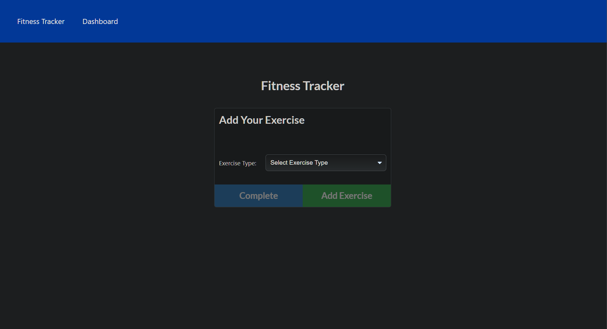

# Look Gud, Feel Gud

Using starter code, I built out a functional excercise mangament application that allows users to create, view, and track workouts.
Each user can create a daily workout regiment to fit their individual excercise needs with elements such as the name of the excercise, weight, 
number of sets/reps, and duration time.

   

  
  
  ## Heroku Deployment
  
  https://sleepy-journey-26809.herokuapp.com/
  
  ## Usage
  
  When the page is loaded, user is given two options, create a new workout, or continue their recent exercise.
  
  * Add exercises to their most recent workout regiment.
  * Add new exercises to new or existing workout regiment.
  * View the total weight of multiple exercises from the past seven workouts on the `stats` page.
  * View the total duration of each workout regiment from the past seven workouts on the `stats` page.

